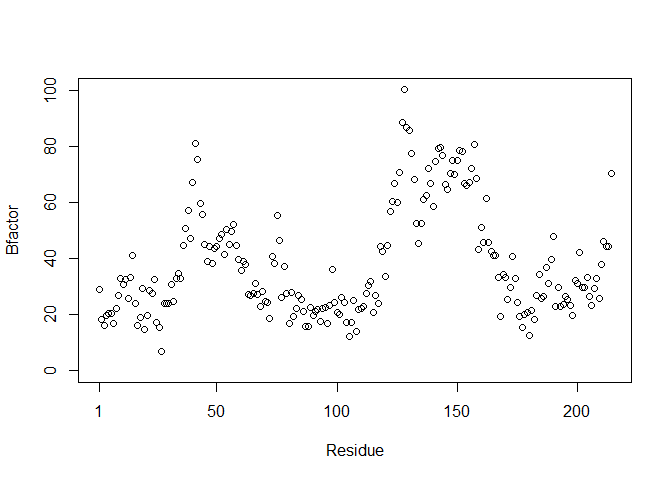

##Section 2B from Class 6


```r
library(bio3d)
s1 <- read.pdb("4AKE") # kinase with drug
```

```
##   Note: Accessing on-line PDB file
```

```r
s2 <- read.pdb("1AKE") # kinase no drug
```

```
##   Note: Accessing on-line PDB file
##    PDB has ALT records, taking A only, rm.alt=TRUE
```

```r
s3 <- read.pdb("1E4Y") # kinase with drug
```

```
##   Note: Accessing on-line PDB file
```

```r
s1.chainA <- trim.pdb(s1, chain="A", elety="CA")
s2.chainA <- trim.pdb(s2, chain="A", elety="CA")
s3.chainA <- trim.pdb(s1, chain="A", elety="CA")
s1.b <- s1.chainA$atom$b
s2.b <- s2.chainA$atom$b
s3.b <- s3.chainA$atom$b
plotb3(s1.b, sse=s1.chainA, typ="l", ylab="Bfactor")
```

<!-- -->

```r
plotb3(s2.b, sse=s2.chainA, typ="l", ylab="Bfactor")
```

<!-- -->

```r
plotb3(s3.b, sse=s3.chainA, typ="l", ylab="Bfactor")
```

<!-- -->


```r
library(bio3d)
s1 <- read.pdb("4AKE")
```

```
##   Note: Accessing on-line PDB file
```

```
## Warning in get.pdb(file, path = tempdir(), verbose = FALSE): C:\Users\huang
## \AppData\Local\Temp\RtmpEvz1RL/4AKE.pdb exists. Skipping download
```

```r
s1.chainA <- trim.pdb(s1, chain="A", elety="CA")
s1.b <- s1.chainA$atom$b
plotb3(s1.b, sse=s1.chainA, typ="p", ylab="Bfactor", top = FALSE, bot = FALSE)
```

<!-- -->


```r
hc <- hclust( dist( rbind(s1.b, s2.b, s3.b) ) )
plot(hc)
```

<!-- -->

#Simplify this function
x 
