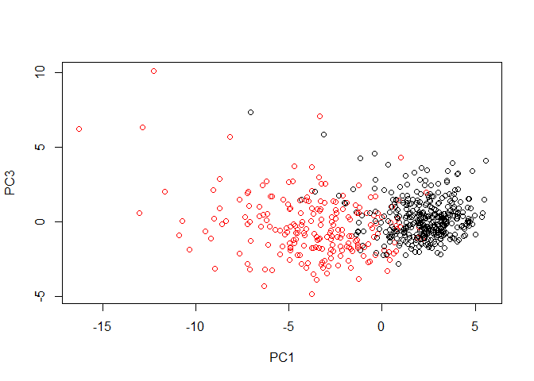

Import the data

```r
wisc.df <- read.csv("WisconsinCancer.csv") 

#convert features (col3 to 32) of data to matrix
wisc.data <- as.matrix(wisc.df[,3:32]) 
#alternatively, as.matrix(wisc.df[,-c(1:2)])

#set row names of wisc.data
row.names(wisc.data) <- wisc.df$id

#create diagnosis vector
diagnosis <- as.numeric(wisc.df$diagnosis == "M")
sum(diagnosis) #confirm how many are malignant
```

```
## [1] 212
```

How many observations are in this dataset?

```r
nrow(wisc.data)
```

```
## [1] 569
```

```r
length(diagnosis)
```

```
## [1] 569
```

How many variables/features in the data are suffixed with _mean?

```r
length(grep("_mean", colnames(wisc.data)))
```

```
## [1] 10
```

How many observations have a malignant diagnosis?

```r
sum(diagnosis)
```

```
## [1] 212
```

## Performing PCA
Check the mean and stdev of features in wisc.data to determine
if needed to be scaled

```r
means <- colMeans(wisc.data) #get column means of wisc.data
plot(means, type="o") #plot to see if we need to do scaling
```

<!-- -->

```r
apply(wisc.data,2,sd)
```

```
##             radius_mean            texture_mean          perimeter_mean 
##            3.524049e+00            4.301036e+00            2.429898e+01 
##               area_mean         smoothness_mean        compactness_mean 
##            3.519141e+02            1.406413e-02            5.281276e-02 
##          concavity_mean     concave.points_mean           symmetry_mean 
##            7.971981e-02            3.880284e-02            2.741428e-02 
##  fractal_dimension_mean               radius_se              texture_se 
##            7.060363e-03            2.773127e-01            5.516484e-01 
##            perimeter_se                 area_se           smoothness_se 
##            2.021855e+00            4.549101e+01            3.002518e-03 
##          compactness_se            concavity_se       concave.points_se 
##            1.790818e-02            3.018606e-02            6.170285e-03 
##             symmetry_se    fractal_dimension_se            radius_worst 
##            8.266372e-03            2.646071e-03            4.833242e+00 
##           texture_worst         perimeter_worst              area_worst 
##            6.146258e+00            3.360254e+01            5.693570e+02 
##        smoothness_worst       compactness_worst         concavity_worst 
##            2.283243e-02            1.573365e-01            2.086243e-01 
##    concave.points_worst          symmetry_worst fractal_dimension_worst 
##            6.573234e-02            6.186747e-02            1.806127e-02
```

Excute PCA to wisc.data

```r
wisc.pr <- prcomp(wisc.data, scale = TRUE) #perform pca using prcomp
#if there are NA's in the data, will get error message
#remove NA's before performing PCA

summary(wisc.pr) #view a summary of the pca
```

```
## Importance of components:
##                           PC1    PC2     PC3     PC4     PC5     PC6
## Standard deviation     3.6444 2.3857 1.67867 1.40735 1.28403 1.09880
## Proportion of Variance 0.4427 0.1897 0.09393 0.06602 0.05496 0.04025
## Cumulative Proportion  0.4427 0.6324 0.72636 0.79239 0.84734 0.88759
##                            PC7     PC8    PC9    PC10   PC11    PC12
## Standard deviation     0.82172 0.69037 0.6457 0.59219 0.5421 0.51104
## Proportion of Variance 0.02251 0.01589 0.0139 0.01169 0.0098 0.00871
## Cumulative Proportion  0.91010 0.92598 0.9399 0.95157 0.9614 0.97007
##                           PC13    PC14    PC15    PC16    PC17    PC18
## Standard deviation     0.49128 0.39624 0.30681 0.28260 0.24372 0.22939
## Proportion of Variance 0.00805 0.00523 0.00314 0.00266 0.00198 0.00175
## Cumulative Proportion  0.97812 0.98335 0.98649 0.98915 0.99113 0.99288
##                           PC19    PC20   PC21    PC22    PC23   PC24
## Standard deviation     0.22244 0.17652 0.1731 0.16565 0.15602 0.1344
## Proportion of Variance 0.00165 0.00104 0.0010 0.00091 0.00081 0.0006
## Cumulative Proportion  0.99453 0.99557 0.9966 0.99749 0.99830 0.9989
##                           PC25    PC26    PC27    PC28    PC29    PC30
## Standard deviation     0.12442 0.09043 0.08307 0.03987 0.02736 0.01153
## Proportion of Variance 0.00052 0.00027 0.00023 0.00005 0.00002 0.00000
## Cumulative Proportion  0.99942 0.99969 0.99992 0.99997 1.00000 1.00000
```


Interpreting PCA results

```r
biplot(wisc.pr) #biplot of PCA results
```

<!-- -->


```r
#Generate a more standard scatter plot for observations 1&2
plot(wisc.pr$x[, c(1,2)], col= (diagnosis + 1),
     xlab = "PC1", ylab = "PC2")
```

<!-- -->

```r
#Generate scatter plot for observations 1&3
plot(wisc.pr$x[, c(1, 3)], col = (diagnosis + 1), 
     xlab = "PC1", ylab = "PC3")
```

<!-- -->

Examine "elbow" of the data

```r
pr.var <- wisc.pr$sdev^2 #find variance of the data
pve <- pr.var/sum(pr.var) #calculate variance explained by each PC

#plot the percent variance
prop_var <- plot(pve,
         xlab = "PC", ylab = "Porportion of Variance Explained",
         ylim = c(0, 1), type = "o")
```

<!-- -->

Create bar plot for the data

```r
barplot(pve, ylab = "Precent of Variance Explained",
        names.arg=paste0("PC",1:length(pve)), las=2, axes = FALSE)
#las=2 means vertical labels
#axes=FALSE means to turn off the y axis so we can add a better one

#add new y axis
axis(2, at=pve, labels=round(pve,2)*100 )
```

<!-- -->

```r
#axis (#) changes where the axis goes
#at = where the ticks are going
#labels = where the numbers will be, multiply by 100 to show percent
```


Plot cumulative proportion of variance explained

```r
cum_var <- plot(cumsum(pve), xlab = "PC", ylab = "Cumulative Proportion of Variance             Explained",
            ylim = c(0,1), type = "o")
```

<!-- -->

Section 3
Hierarchical clustering of case data

```r
data.scaled <- scale(wisc.data) #scale data
data.dist <- dist(data.scaled) #calculate euclidean distance btw pairs of obs
wisc.hclust <- hclust(data.dist, method = "complete") #do hclust on data
plot(wisc.hclust) #plot the dendrogram
abline(h=20, col="red")
```

<!-- -->

Selecting number of clusters

```r
wisc.hclust.clusters <- cutree(wisc.hclust, k=4) #cut hclust into 4 clusters
#use table() fxn to compare cluster membership to actual diagnosis
table(wisc.hclust.clusters, diagnosis)
```

```
##                     diagnosis
## wisc.hclust.clusters   0   1
##                    1  12 165
##                    2   2   5
##                    3 343  40
##                    4   0   2
```

```r
#cut tree into 2 clusters
wisc.hclust.2clusters <- cutree(wisc.hclust, k=2)
table(wisc.hclust.2clusters, diagnosis)
```

```
##                      diagnosis
## wisc.hclust.2clusters   0   1
##                     1 357 210
##                     2   0   2
```

```r
#cut tree into 3 clusters
wisc.hclust.3clusters <- cutree(wisc.hclust, k=3)
table(wisc.hclust.3clusters, diagnosis)
```

```
##                      diagnosis
## wisc.hclust.3clusters   0   1
##                     1 355 205
##                     2   2   5
##                     3   0   2
```

```r
#cut tree into 5 clusters
wisc.hclust.5clusters <- cutree(wisc.hclust, k=5)
table(wisc.hclust.5clusters, diagnosis)
```

```
##                      diagnosis
## wisc.hclust.5clusters   0   1
##                     1  12 165
##                     2   0   5
##                     3 343  40
##                     4   2   0
##                     5   0   2
```

Section 4
K-means clustering and comparing results

```r
wisc.km <- kmeans(data.scaled, centers = 2, nstart = 20)
#centers = k
#nstart = how many runs to repeat this

#compare our 2 km clusters to diagnosis
table(wisc.km$cluster, diagnosis)
```

```
##    diagnosis
##       0   1
##   1 343  37
##   2  14 175
```


```r
#compare clusters from kmeans model to clusters for hc model
table(wisc.hclust.clusters, wisc.km$cluster)
```

```
##                     
## wisc.hclust.clusters   1   2
##                    1  17 160
##                    2   0   7
##                    3 363  20
##                    4   0   2
```


Section 5
Clustering on PCA results
Make the clusters more apparent by using PCA to cluster

```r
# Use the distance along the first 7 PCs for clustering i.e. wisc.pr$x[, 1:7]
wisc.pr.hclust <- hclust(dist(wisc.pr$x[,1:3]), method = "ward.D2")
plot(wisc.pr.hclust)
```

<!-- -->


```r
wisc.pr.hclust.clusters <- cutree(wisc.pr.hclust, k=4)
#cut into 4 clusters

plot(wisc.pr$x[,1:2], col=wisc.pr.hclust.clusters)
```

<!-- -->

```r
table(wisc.pr.hclust.clusters, diagnosis)
```

```
##                        diagnosis
## wisc.pr.hclust.clusters   0   1
##                       1   0 111
##                       2  24  68
##                       3 184  32
##                       4 149   1
```


```r
library(rgl)

#create a 3d plot for the clusters using rgl
plot3d(wisc.pr$x[,1:2], type = "s", col = wisc.pr.hclust.clusters)
```


```r
url <- "https://tinyurl.com/new-samples-CSV"
new <- read.csv(url)
npc <- predict(wisc.pr, newdata = new)

plot(wisc.pr$x[,1:2], col=wisc.pr.hclust.clusters)
points(npc[,1], npc[,2], col=c("orange", "pink"), pch=16, cex=3)
```

<!-- -->


